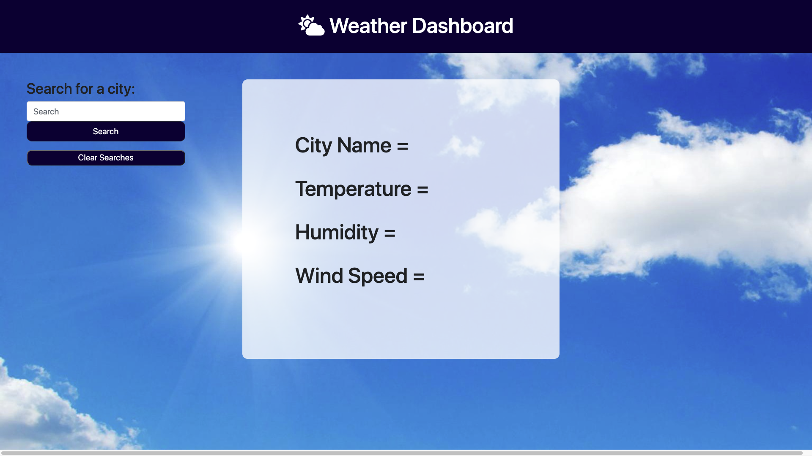

# The-Weather-Dashboard

## User Story

As a traveler, I want to see the weather outlook for multiple cities so I can plan a trip accordingly.

##  Acceptance Criteria

1. A weather dashboard with form inputs.

2. When I search for a city, I am presented with current and future conditions for that city and that city is added to the search history.

3. When I view current weather conditions for that city, I am presented with the city name, the date, an icon representation of weather conditions, the temperature, the humidity, the wind speed, and the UV index.

4. When I view the UV index, I am presented with a color that indicates whether the conditions are favorable, moderate, or severe.

5. When I view future weather conditions for that city, I am presented with a 5-day forecast that displays the date, an icon representation of weather conditions, the temperature, and the humidity.

5. When I click on a city in the search history, I am again presented with current and future conditions for that city.

6. When I open the weather dashboard, I am presented with the last searched city forecast.
 

## Deployed Live Here: https://codyalmand.github.io/The-Weather-Dashboard/

